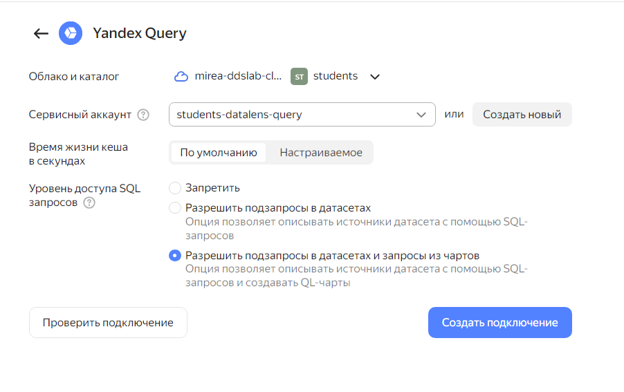
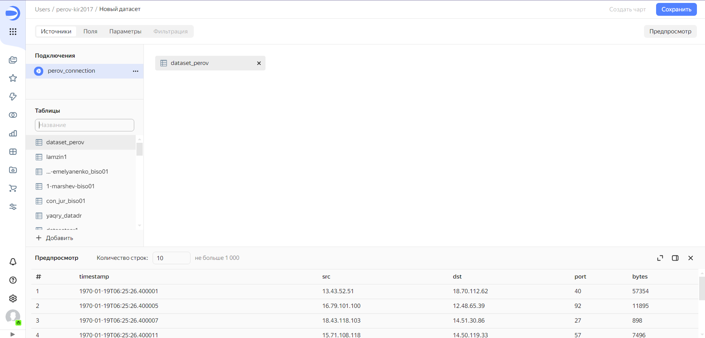
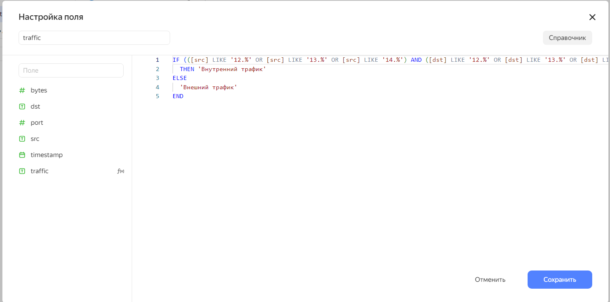
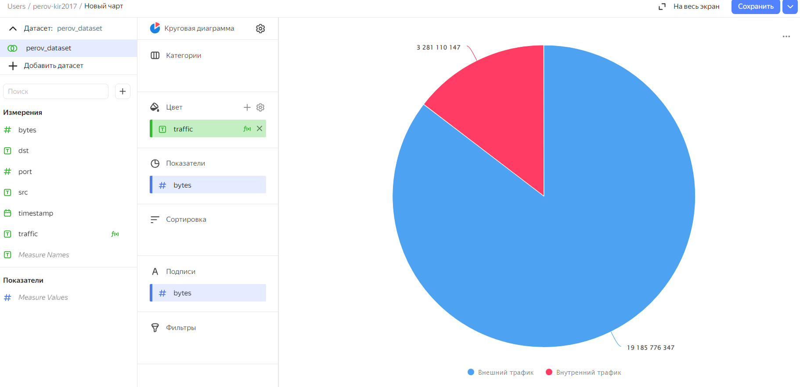
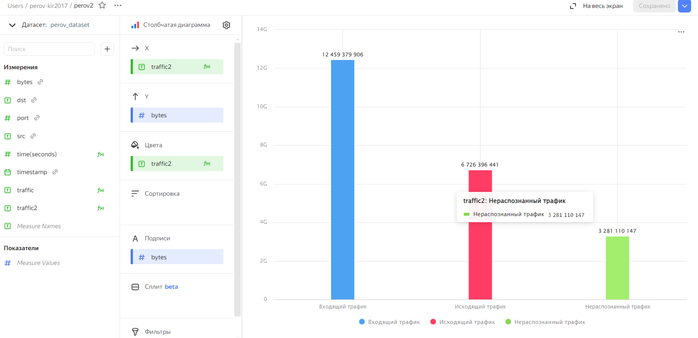
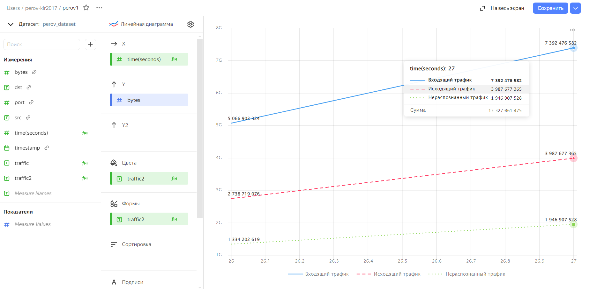
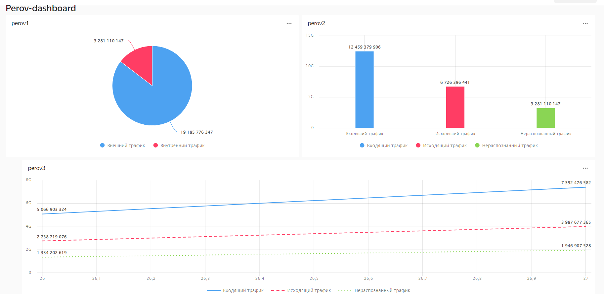

lab_2
================
Perov Kirill

# Использование технологии Yandex DataLens для анализа данных сетевой активности

## Цель работы

1.  Изучить возможности технологии `Yandex DataLens` для визуального
    анализа структурированных наборов данных
2.  Получить навыки визуализации данных для последующего анализа с
    помощью сервисов `Yandex Cloud`
3.  Получить навыки создания решений мониторинга/SIEM на базе облачных
    продуктов и открытых программных решений
4.  Закрепить практические навыки использования SQL для анализа данных
    сетевой активности в сегментированной корпоративной сети

## Исходные данные

1.  ОС Windows 10
2.  Yandex Cloud: S3 Object Storage
3.  Yandex Query
4.  Yandex DataLens
5.  Датасет yaqry_dataset.pqt

**Общая ситуация**

Вы продолжаете развитие своих решений, выполненных в ходе практической
работы №1.

Для понимания сетевой обстановки и принятия решений по управлению
информационной безопасностью Вам необходимо визуально представить
результаты анализа информации, выполненной в `Yandex Query` с помощью
продукта `DataLens`. Конкретнее – serverless решение в облаке
`Yandex Cloud`.

Как и прежде, у Вас есть данные сетевой активности в корпоративной сети
компании XYZ. Данные хранятся в `Yandex Object Storage`. Вы провели
разведочный анализ данных и имеете представление о структуре данных.

Вам необходимо построить `observability` решение – средство визуального
представления информации для мониторинга и оценки сетевой активности.

## Задание

Используя сервис `Yandex DataLens` настроить доступ к результатам
`Yandex Query`, полученным в ходе выполнения практической работы №1, и
визуально представить результаты анализа данных

## Задачи

1.  Представить в виде круговой диаграммы соотношение внешнего и
    внутреннего сетевого трафика
2.  Представить в виде столбчатой диаграммы соотношение входящего и
    исходящего трафика из внутреннего сетевого сегмента
3.  Построить график активности (линейная диаграмма) объема трафика во
    времени
4.  Все построенные графики вывести в виде единого дашборда в
    `Yandex DataLens`

## Ход работы

### Шаг 1. Настроить подключение к **Yandex Query** из **DataLens**

Для начала необходимо перейти в сервис [Yandex
DataLens](https://datalens.yandex.ru/) и создать новое подключение. В
нашем случае нужно использовать уже существующий сервисный аккаунт
`students-datalens-query`



### Шаг 2. Создать из запроса Yandex Query датасет DataLens

Для того, чтобы создать датасет, необходимо выбрать только что созданное
подключение и перетащить датасет, который остался с прошлой практической
работы. Видим нашу таблицу сетевого трафика




### Шаг 3. Создать чарты

-   Круговая диаграмма соотношения внешнего и внутреннего сетевого
    трафика. (Внутренняя сеть с IP-адресами 12… 13… 14…)

<!-- -->

    IF (([src] LIKE '12.%' OR [src] LIKE '13.%' OR [src] LIKE '14.%') AND ([dst] LIKE '12.%' OR [dst] LIKE '13.%' OR [dst] LIKE '14.%'))
      THEN 'Внутренний трафик'
    ELSE
      'Внешний трафик'
    END





-   Представить в виде столбчатой диаграммы соотношение входящего и
    исходящего трафика из внутреннего сетвого сегмента.

<!-- -->

    IF (LEFT([src], 3) IN ('12.', '13.', '14.') AND LEFT([dst], 3) NOT IN ('12.', '13.', '14.'))
        THEN 'Исходящий трафик'
    ELSEIF (LEFT([dst], 3) IN ('12.', '13.', '14.') AND LEFT([src], 3) NOT IN ('12.', '13.', '14.'))
        THEN 'Входящий трафик'
    ELSE
        'Нераспознанный трафик'
    END



-   Построить график активности (линейная диаграмма) объема трафика во
    времени.

Необходимо преобразовать поле с временем, для отображения достаточно
секунд. Логика прокраски из предыдущего запроса.



-   Все построенные графики вывести в виде единого дашборда в Yandex
    DataLens.



Ссылка на дашборд:
https://datalens.yandex.cloud/l4or60lck81y9-perov-dashboard

``` r
sprintf("Done")
```

    [1] "Done"

## Оценка результатов

В ходе практической работы был проведен анализ сетевой активности с
помощью SQL

## Вывод

Были получены начальные навыки работы с **Yandex Cloud**, а также с
сервисом **Yandex DataLens**
